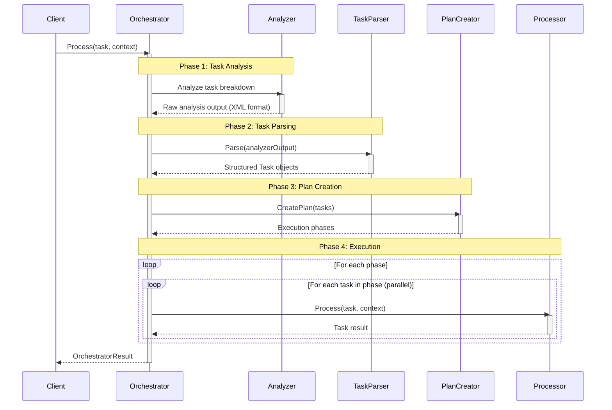
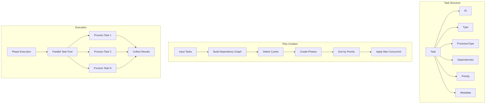
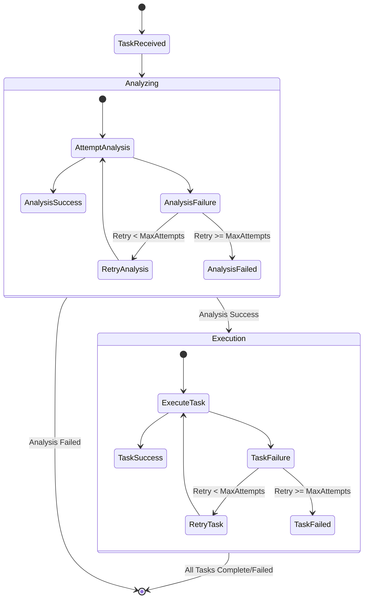

How Orchestrator works high level
---------------------------------

Task dependency resolution
--------------------------

Error handling and retry flow explained
---------------------------------------

